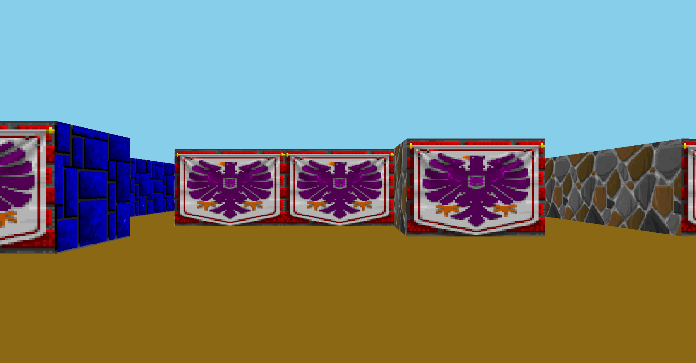
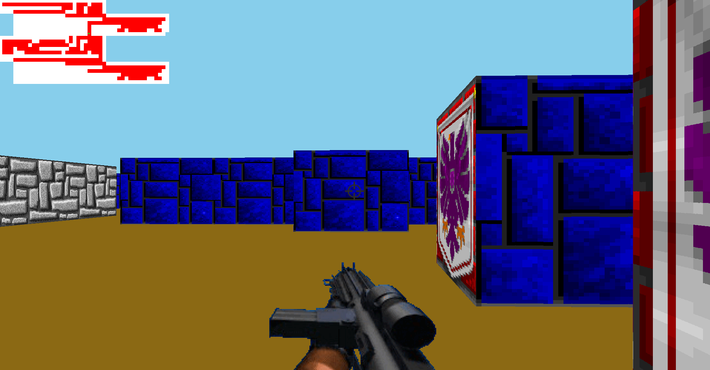

# Cub3D
A project about creating a 3D game using raycasting.

>Click [Here](https://www.youtube.com/watch?v=oukQ9P6_49k) to see the project running.
## Table of Contents

- [Sources and Acknowledgments](#sources-and-acknowledgments)
- [Introduction](#introduction)
- [Raycaster](#raycaster)
- [Usage](#usage)
- [License](#license)

## Sources and Acknowledgments
I would like to share the key resources that helped me to construct this project. My sincere thanks go out to everyone who has shared their knowledge freely with the community.
- [Sprites Resource](https://www.spriters-resource.com)
- [Lode's Computer Graphics Tutorial - Raycasting](https://lodev.org/cgtutor/raycasting.html) - By [Lode Vandevenne](https://lodev.org/)
- [Raycasting in Scratch Playlist](https://www.youtube.com/watch?v=M1c5TcdITVs&list=PLy4zsTUHwGJKolO9Ko_j6IStFIJnTYBul) - By [Griffpatch](https://www.youtube.com/@griffpatch)
- [Make Your Own Raycaster Part 1 ](https://www.youtube.com/watch?v=gYRrGTC7GtA&t=842s) - By [3DSage](https://www.youtube.com/@3DSage) - For this video, search also for part 2 and 3.

Also, the next source is not this used to study the technique of Raycasting, but
Raytracing instead. But it worth to mention. Raytracing technique is used in the "brother" project of Cub3d, called MiniRT.
[Ray Tracing in one weekend](https://raytracing.github.io/) - By [Raytracing](https://github.com/RayTracing)

And I would like to thank my peers from 42 Porto, who helped me a lot during all the process of this complex project. Thank you all. Sharing knowledge make us better. Special thanks to [Vinicius Vaccari](https://github.com/vivaccar/vivaccar), my partner throughout this project, who co-constructed this project with me.


## Introduction
The Cub3D project at 42 is an introduction to 3D graphics development using the technique of raycasting. The goal is to create a first-person game similar to the classic Wolfenstein 3D, where the player navigates through a maze and views the environment in a 3D perspective, even though the map is represented as a 2D grid. This project provides a practical way to learn the fundamentals of 3D rendering and graphics manipulation using MiniLibX, a small graphical library provided by the school. The implementation involves setting up a raycasting system that simulates the 3D effect by casting rays from the player's position to detect walls and render them accordingly.
>For the complete requirements and limitations of the project, read the [subject](subject/cub3.subject.pdf)

>The code was written according to the 42 norm guidelines(norminette). <br>
[View Norm](42_norm/en.norm.pdf)

>You can check more information about MiniLibx in this documentation: https://harm-smits.github.io/42docs/libs/minilibx



## Technologies
- **Programming Language**: C
- **Library**: MiniLibX (provided by the 42 school)
- **Environment**: Linux.

## Map Configuration

The program must take as a first argument a scene description file with the `.cub` extension. This file describes the map and the various elements needed for the game to function properly.

### Map Composition
- The map must be composed of only 6 possible characters:
  - `0` for an empty space.
  - `1` for a wall.
  - `N, S, E, W` for the player’s start position and orientation (North, South, East, or West).

- Example of a simple valid map:
```bash
1111111111
1001000001
1010000011
1100N00111
1111111111
```

### Map Requirements
- The map must be **closed** or **surrounded by walls** (`1`). If the map is not properly enclosed, the program must return an error.
- Except for the map content (which is always the last element), each type of information can be separated by one or more empty lines.
- Each type of element, except for the map, can be placed in any order in the file.
- Each element (except the map) begins with an identifier, followed by the relevant information for that element. These identifiers and their details are listed below:

### Elements and Identifiers
1. **Textures**: Textures for each direction (North, South, East, and West) are specified as follows:
 - North Texture:
   ```
   NO ./path_to_the_north_texture
   ```
   - Identifier: `NO`
   - Path: Path to the north texture file.

 - South Texture:
   ```
   SO ./path_to_the_south_texture
   ```
   - Identifier: `SO`
   - Path: Path to the south texture file.

 - West Texture:
   ```
   WE ./path_to_the_west_texture
   ```
   - Identifier: `WE`
   - Path: Path to the west texture file.

 - East Texture:
   ```
   EA ./path_to_the_east_texture
   ```
   - Identifier: `EA`
   - Path: Path to the east texture file.

2. **Colors**: Floor and ceiling colors are defined using RGB values in the range `[0,255]`:
 - Floor Color:
   ```
   F 220,100,0
   ```
   - Identifier: `F`
   - RGB Values: `220, 100, 0`

 - Ceiling Color:
   ```
   C 225,30,0
   ```
   - Identifier: `C`
   - RGB Values: `225, 30, 0`
  
## Raycaster
Raycasting is a rendering technique used in 2D maps to create a 3D perspective. The basic idea is to cast rays from the player's point of view into the game world, one for each vertical line of the screen. Each ray travels until it hits a wall, determining the distance to that wall. This distance is then used to draw vertical strips on the screen, simulating the depth and perspective of a 3D environment.

### Key Variables before start
Before diving into the code, let's understand the key variables used in the raycaster:

- **dir_x** and **dir_y**: These represent the player's viewing direction in the 2D space. If the player is looking north, `dir_y` will be `-1` (since y-coordinates decrease as you move up), and `dir_x` will be `0` (no horizontal movement). If the player is looking east, `dir_x` will be `1`, and `dir_y` will be `0`.
- **plane_x** and **plane_y**: These define the camera plane perpendicular to the direction vector, controlling the field of view. For example, if the player is facing north, `plane_x` is `0.66` and `plane_y` is `0` (extending left and right horizontally). If the player is facing east, `plane_x` is `0` and `plane_y` is `0.66` (extending up and down vertically).
- **cam_x**: This variable represents the x-coordinate of the camera for each vertical screen line, ranging from -1 (left) to 1 (right). It's used to calculate the direction of each ray.

After that, we perform the following sequence of calculations for each column x of the screen:

### 1. `rays_direction(t_ray *ray, int x)`
This function calculates the direction of the ray for each vertical strip (`x`) on the screen:

```c
void rays_direction(t_ray *ray, int x)
{
    ray->cam_x = 2 * x / (double)WIDTH - 1;
    ray->ray_dir_x = ray->dir_x + ray->plane_x * ray->cam_x;
    ray->ray_dir_y = ray->dir_y + ray->plane_y * ray->cam_x;
}
```
### 2. delta_dstc(t_ray *ray)
This function calculates the distance the ray must travel in the x and y directions before crossing a grid line:

```c
void delta_dstc(t_ray *ray)
{
    if (ray->ray_dir_x == 0)
        ray->delta_dstc_x = INT_MAX;
    else
        ray->delta_dstc_x = fabs(1 / ray->ray_dir_x);

    if (ray->ray_dir_y == 0)
        ray->delta_dstc_y = INT_MAX;
    else
        ray->delta_dstc_y = fabs(1 / ray->ray_dir_y);
}
```
The function sets delta_dstc_x and delta_dstc_y to the absolute value of the reciprocal of the ray direction. This represents the distance a ray needs to travel horizontally or vertically to cross a grid line. If the ray direction is zero, it prevents division by zero by setting the distance to the maximum integer value (INT_MAX).

### 3. step_increment(t_ray *ray)
This function determines the direction and initial distance for each step the ray takes through the grid:

```c
void	step_increment(t_ray *ray)
{
	t_ray	*r;

	r = ray;
	r->step_x = 1;
	r->side_dstc_x = (r->map_x + 1.0 - r->plyr_x) * r->delta_dstc_x;
	if (r->ray_dir_x < 0)
	{
		r->step_x = -1;
		r->side_dstc_x = (r->plyr_x - r->map_x) * r->delta_dstc_x;
	}
	r->step_y = 1;
	r->side_dstc_y = (r->map_y + 1 - r->plyr_y) * r->delta_dstc_y;
	if (r->ray_dir_y < 0)
	{
		r->step_y = -1;
		r->side_dstc_y = (r->plyr_y - r->map_y) * r->delta_dstc_y;
	}
}
```
- **step_x and step_y:** These define the step direction (either 1 or -1) based on the ray's direction. If the ray points left or up, the step is -1.
- **side_dstc_x and side_dstc_y:** These store the initial distance from the player's position to the next x or y grid boundary.

### 4. launch_ray(t_ray *ray, t_map *map)
This function advances the ray through the map until it hits a wall or an empty space:

```c
while (!hit)
{
    if (ray->side_dstc_x < ray->side_dstc_y)
    {
        ray->side_dstc_x += ray->delta_dstc_x;
        ray->map_x += ray->step_x;
        ray->side_hit = 0;
        ray->wall_ppclr_dstc = ray->side_dstc_x - ray->delta_dstc_x;
    }
    else
    {
        ray->side_dstc_y += ray->delta_dstc_y;
        ray->map_y += ray->step_y;
        ray->side_hit = 1;
        ray->wall_ppclr_dstc = ray->side_dstc_y - ray->delta_dstc_y;
    }
    if (map->matriz[ray->map_y][ray->map_x] == '1' || map->matriz[ray->map_y][ray->map_x] == ' ')
        hit = 1;
}
```
- **side_hit** indicates whether the ray hit a vertical EAST/WEST or horizontal NORTH/SOUTH wall.
-  The ray moves through the grid in steps defined by step_x and step_y. It increments its distance (side_dstc_x or side_dstc_y) until it hits a wall.

### 5. **Calculate Wall Height and Draw**: The height of the wall segment to be drawn is calculated using the formula:

   \[
   \text{r\_line\_len} = \frac{\text{HEIGHT}}{\text{ray->wall\_ppclr\_dstc}}
   \]

   This formula determines the height of the wall on the screen based on the distance from the player to the wall (`ray->wall_ppclr_dstc`). A shorter distance results in a taller wall segment, simulating perspective. 

   The texture's horizontal position is calculated as:

   \[
   \text{txt\_x} = \text{wall\_hit\_pos} \times \text{txt\_w}
   \]

   where `wall_hit_pos` is the intersection point along the wall, ensuring the correct part of the texture is displayed. The vertical mapping of the texture is adjusted based on the calculated wall height, allowing for correct rendering regardless of the wall's height. Finally, textures are applied depending on the side of the wall that was hit.

## Usage


0. In your terminal, download the project
```bash
git@github.com:amauricoder/42_Cub3D.git
```
1. Enter the folder and run the make command:

```bash
cd 42_Cub3D
make
```
2. Run the executable with the path to the map file as argument:

```bash
./cub3D "path_to_map_file"
```

## Bonus Features

For the bonus part of the project, we implemented several additional features. Our project includes a minimap, the player carries a weapon that can be fired, and we implemented mouse movement and collision detection with walls.

1. Run the make command:

```bash
make bonus
```
2. Run the executable with the path to the map file as argument:

```bash
./cub3D_bonus "path_to_map_file"
```
Example of the Bonus Implementations:



## Usability of cub3D

In the cub3D game, the following controls are implemented for player movement and actions:

- **W**: Move the player forward in the direction they are facing.
- **S**: Move the player backward.
- **A**: Move the player to the left (strafe left).
- **D**: Move the player to the right (strafe right).
- **Arrow Keys (Left and Right)**: Rotate the player's view left or right, allowing for easier navigation of the environment.
- **Mouse Movement (Left and Right)**: Similar to the arrow keys, moving the mouse left or right also rotates the player's view.
- **Shift**: Fires the weapon.

## LICENSE
[License](LICENSE)
